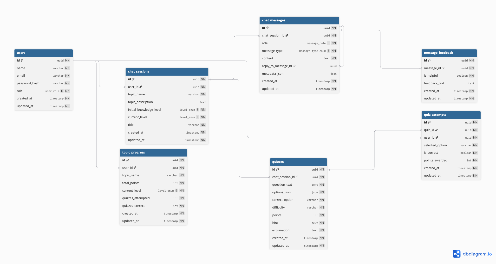

# Adaptive Learning Platform - Phase 3

AI-powered adaptive learning system with chat-based tutoring, quizzes, progress tracking, and reference material recommendations.

***For Detailed Documentation, refer to:*** [Phase-3 Proposal Doc](https://docs.google.com/document/d/1vDqKU6d4IlpRKwyX2emUjY5XjjH3chIDVsmdPpdN8Ng/edit?usp=sharing)


## Database Schema



## Project Structure

```
adaptive-learning-phase3/
│
├── frontend/                     # Streamlit UI (chat, quiz, analytics dashboard)
│
├── backend/                      # FastAPI backend (APIs, DB, business logic)
│   ├── app/
│   │   ├── main.py               # FastAPI entry point
│   │   │
│   │   ├── config.py             # Environment & settings
│   │   │
│   │   ├── db/                   # Database configuration
│   │   │   ├── session.py
│   │   │   ├── base.py
│   │   │   └── dependencies.py
│   │   │
│   │   ├── models/               # SQLAlchemy ORM models
│   │   │   ├── user.py
│   │   │   ├── chat_session.py
│   │   │   ├── chat_message.py
│   │   │   ├── quiz.py
│   │   │   └── ...
│   │   │
│   │   ├── dtos/                 # Pydantic schemas (request/response)
│   │   ├── repositories/         # Database access layer
│   │   ├── services/             # Business logic layer
│   │   ├── routers/              # API route definitions
│   │   ├── llm/                  # LLM providers & prompt handling
│   │   ├── search/               # Search providers (SearXNG)
│   │   │   ├── base_provider.py
│   │   │   ├── searxng_provider.py
│   │   │   └── factory.py
│   │   └── utils/                # Security & helper utilities
│   │
│   ├── alembic/                  # Database migrations
│   │   ├── versions/
│   │   └── env.py
│   │
│   ├── alembic.ini
│   ├── requirements.txt
│   └── Dockerfile
│
├── searxng/                      # SearXNG search engine config
│   └── settings.yml
│
├── assets/                       # Diagrams & static assets
│   └── DB_Schema_Diagram.png
│
├── docker-compose.yaml           # Multi-container setup (DB + Backend + SearXNG)
└── README.md
```

## Setup Instructions

### 0. Create .env file

```bash
cp .env.example .env
```

Edit the .env file with your own credentials.

### 1. Start Services

```bash
docker compose -f docker-compose.yaml up --build -d
```

### 2. Check Running Containers

```bash
docker compose ps
```

### 3. Run Database Migrations

```bash
docker compose exec backend alembic upgrade head
```

#### 3.1 Create New Migration (After Model Changes)

```bash
docker compose exec backend alembic revision --autogenerate -m "your message"
```

#### 3.2 Access PostgreSQL Shell

```bash
docker exec -it adaptive_db psql -U postgres -d adaptive_db
```

### 4. Running Tests (Isolated Test Environment)
We use a separate compose file for testing to ensure:
- No volume mounting
- Clean isolated container
- Deterministic test execution
- No external LLM calls (LLM is mocked)

#### 4.1 Run Tests

```bash
docker compose -f docker-compose.dev.yaml run --rm backend pytest -v -p no:warnings
```

#### 4.2. Expected Output

```
collected 7 items

tests/integration/test_auth_api.py::test_signup_api PASSED
tests/integration/test_chat_api.py::test_create_chat_api PASSED
tests/unit/test_analytics_service.py::test_accuracy_calculation PASSED
tests/unit/test_auth_service.py::test_signup_success PASSED
tests/unit/test_auth_service.py::test_signup_duplicate PASSED
tests/unit/test_progress_service.py::test_level_upgrade PASSED
tests/unit/test_quiz_service.py::test_submit_wrong_answer PASSED

7 passed in 1.xx s
```


### 5. Stop Containers

```bash
docker compose down
```

#### 5.1 Stop and Remove Volumes (Deletes DB Data)

```bash
docker compose down -v
```
**Note:** This will permanently delete database data.

## Which Compose File Is Used For What
| File                      | Purpose                                                     |
| ------------------------- | ----------------------------------------------------------- |
| `docker-compose.yaml`     | Main development environment (with backend volume mount)    |
| `docker-compose.dev.yaml` | Test-only environment (no volume mount, isolated execution) |

**Use:**
- `docker-compose.yaml` → to run the application
- `docker-compose.dev.yaml` → to run test suite

## Accessing the Application

- **Frontend (Streamlit)**: http://localhost:8501
- **Backend API**: http://localhost:8000
- **SearXNG Search**: http://localhost:8080
- **PostgreSQL**: localhost:5432

**For API Documentation (Swagger)**: http://localhost:8000/docs

## Visualizing Database with DBeaver

1. Open **DBeaver**
2. Click **New Database Connection**
3. Select **PostgreSQL**
4. Use the following:

    ```code
    Host: localhost
    Port: 5432
    Database: adaptive_db
    Username: postgres
    Password: (from your .env file)
    ```
5. Click **Test Connection**
6. Click **Finish**